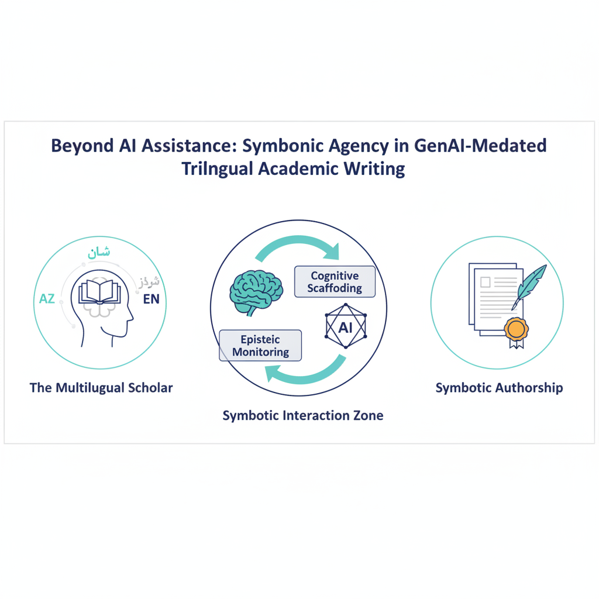
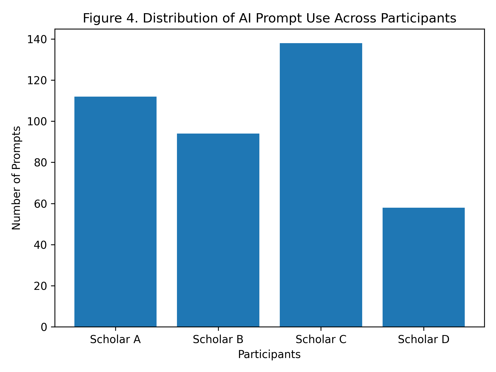
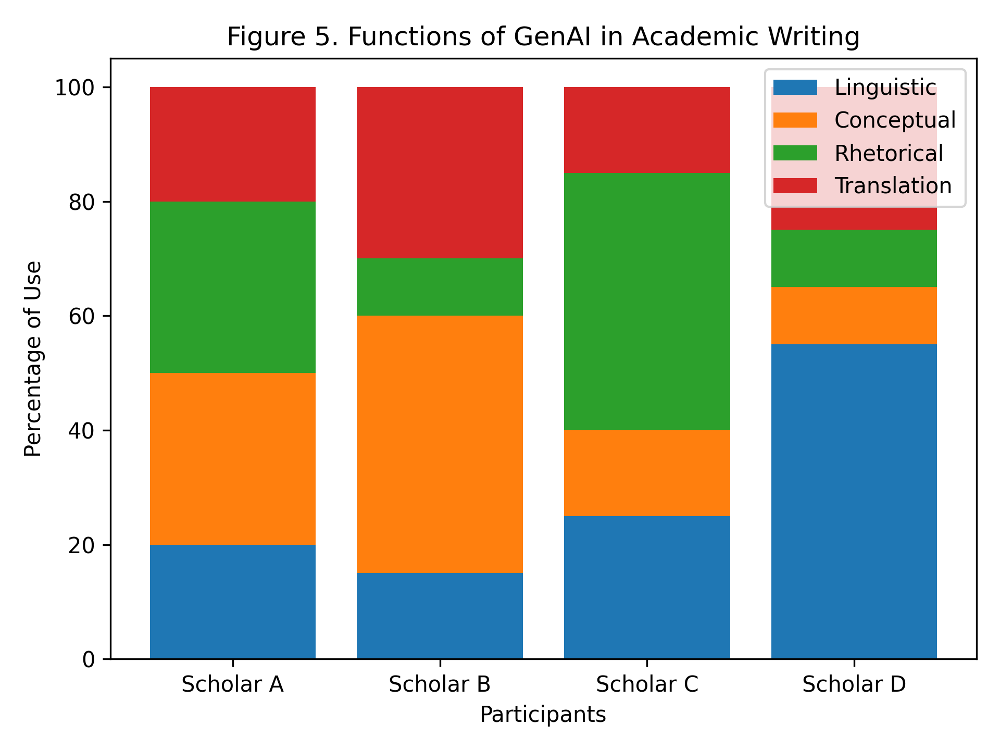
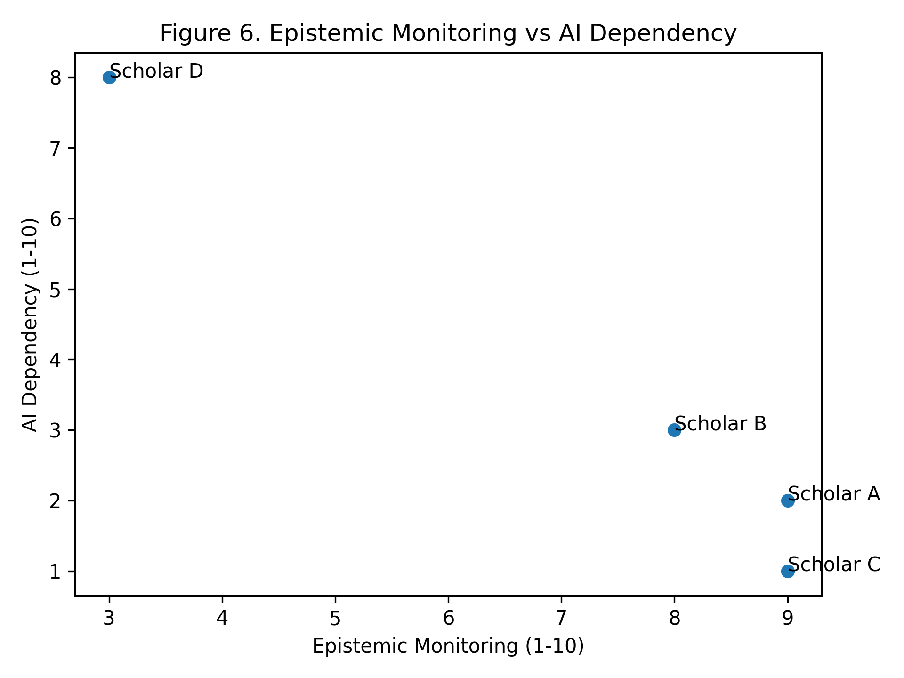
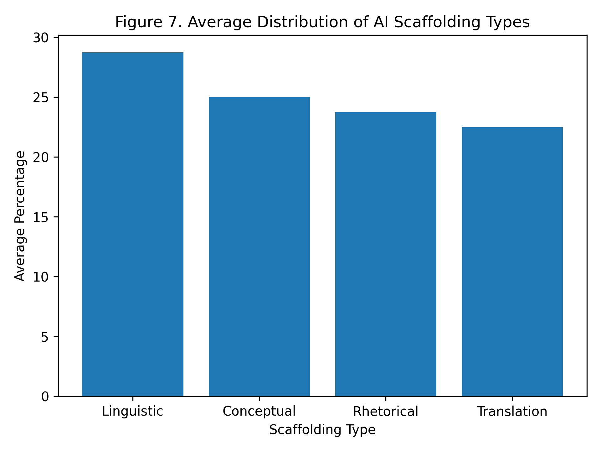

# Symbiotic Agency in Trilingual Writing

This repository contains the dataset, figures, and manuscript for the study on **Symbiotic Agency** in AI-assisted trilingual writing contexts.

## 📊 Visual Resources (Figures)

Below are the key figures representing the theoretical framework and empirical findings of this study.

| Figure | Description | Preview |
| :--- | :--- | :--- |
| **Graphical Abstract** | Conceptual overview of the study |  |
| **Figure 4** | Distribution of Prompting Strategies |  |
| **Figure 5** | AI Functions Distribution |  |
| **Figure 6** | Monitoring vs. Dependency Correlation |  |
| **Figure 7** | Scaffolding Types Matrix |  |

---

## 📁 Repository Structure

- `/data`: Contains all raw datasets (CSV/Excel) and high-resolution figures.
- `/manuscript`: LaTeX source files for the research article.
- `/supplementary`: Additional coding frameworks and methodology details.

## 🛠 How to Use
1. Refer to `data/Journal_Ready_Study_Data.xlsx` for the complete dataset.
2. The main manuscript can be compiled from `Full_Research_Article.tex`.
## 📂 Data & Methodology

The datasets and supplementary methods are organized as follows:

- **Raw Data Directory (`/raw-data`):**
  - `Journal_Ready_Study_Data.xlsx`: Main integrated dataset.
  - `Journal_Ready_Study_Data_Table_1_-_Participants.csv`: Demographic and profile data.
  - `Journal_Ready_Study_Data_Table_2_-_AI_Interactions.csv`: Prompt interaction logs.
  - `Journal_Ready_Study_Data_Table_3_-_Symbiotic_Model.csv`: Metrics for the symbiotic agency model.

- **Manuscript Resources (`/manuscript`):**
  - `methods_discussion_sections.tex`: LaTeX source files for methodology and discussion sections.
## 📝 How to Cite

If you use this dataset or the methodology in your research, please cite the following:

**For the repository:**
> [Merrikhi], [Pegah]. (2026). *Symbiotic Agency in Trilingual Writing* [Data set]. GitHub. https://github.com/Pegi1727/symbiotic-agency-trilingual-writing

**For the research article (if applicable):**
> [Merrikhi], [Pegah]. (2026). Title of your article. *BJTL*, Volume(Issue). DOI: [Insert DOI if available]

---
*Alternatively, you can use the BibTeX format:*
```bibtex
@misc{symbiotic_agency_2026,
  author = {[Your Last Name], [Your First Name]},
  title = {Symbiotic Agency in Trilingual Writing},
  year = {2026},
  publisher = {GitHub},
  journal = {GitHub repository},
  howpublished = {\url{https://github.com/Pegi1727/symbiotic-agency-trilingual-writing}}
}

---
*Note: This repository is part of a Q1 journal submission process.*
